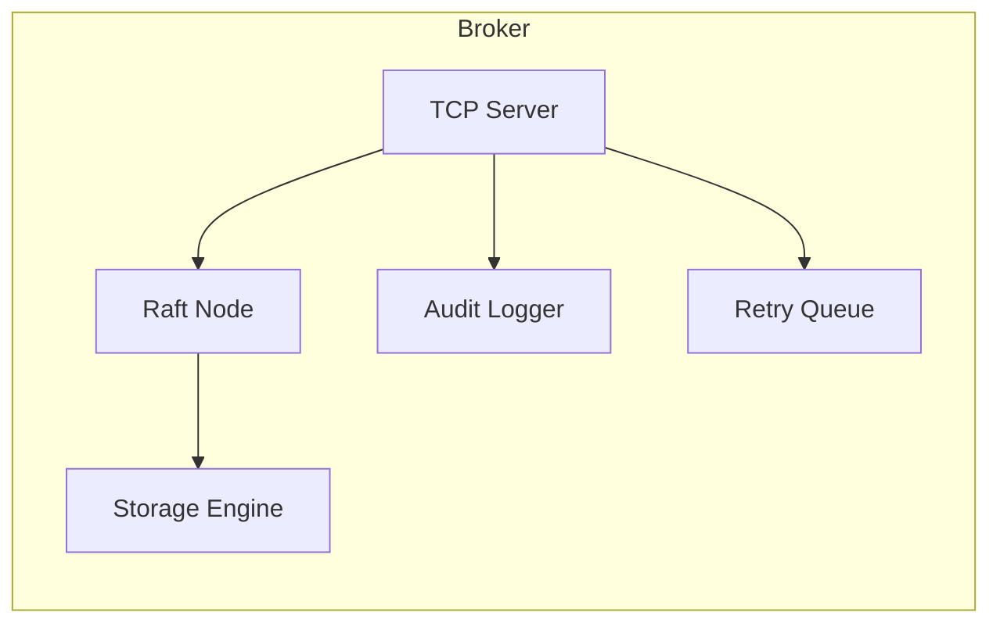
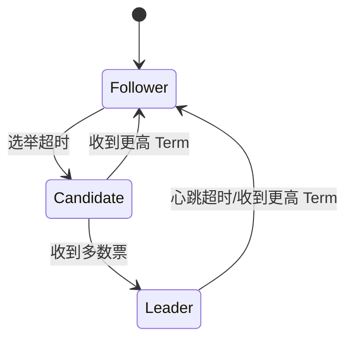
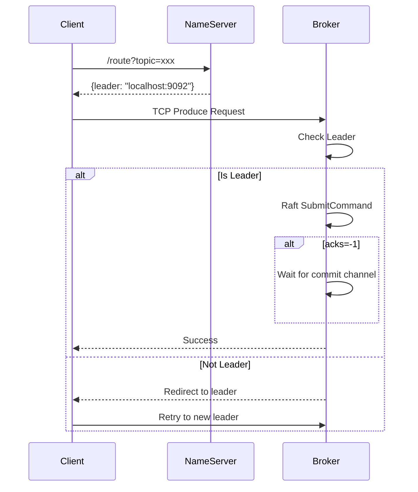
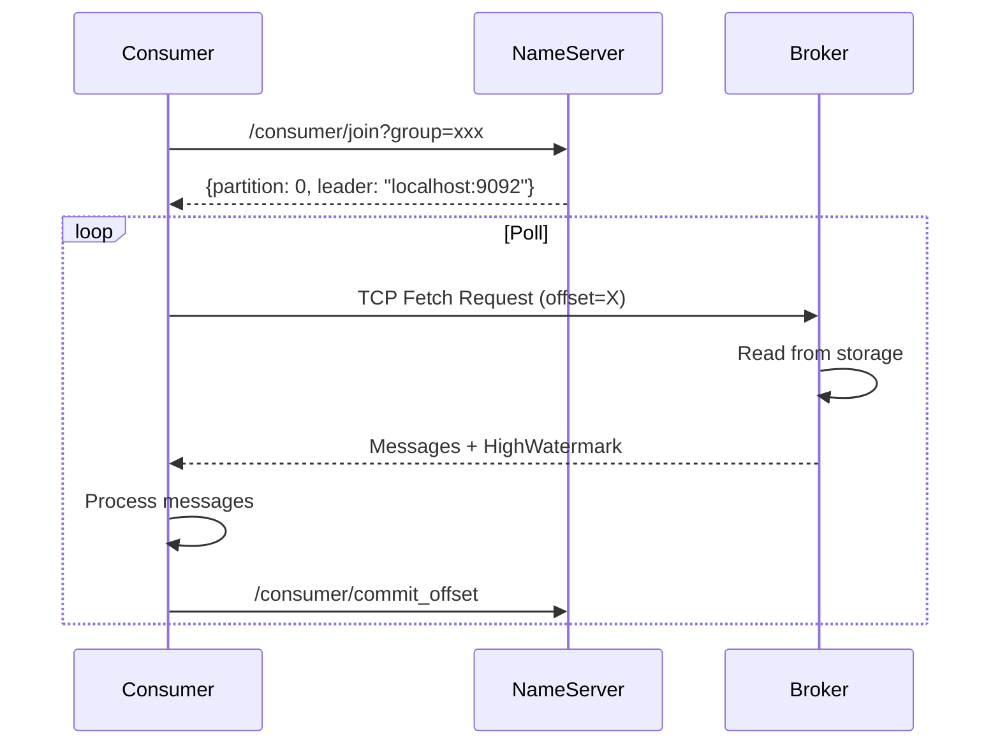

# DistributedMQ 架构设计文档

## 设计理念

DistributedMQ 采用多语言混合架构，充分发挥每种语言的优势：

| 语言 | 用途 | 优势 |
|------|------|------|
| **Go** | 集群核心逻辑 | 高并发、协程轻量、网络编程优秀、编译快 |
| **C** | 存储引擎 | 极致性能、mmap 内存映射、直接操控文件系统 |
| **Java** | 客户端 SDK | 生态成熟、Spring Boot 集成、业务研发友好 |

## 核心架构

### 1. NameServer

**职责**：
- Broker 注册与心跳管理
- Topic 路由信息维护
- Consumer Group 协调

**数据结构**：
```go
type NameServer struct {
    topics         map[string]*TopicInfo
    brokers        map[int]*BrokerInfo
    consumerGroups map[string]*ConsumerGroup
    offsetStore    *OffsetStore
}
```

**关键 API**：
- `/register` - Broker 注册
- `/topic/create` - 创建 Topic
- `/route` - 获取路由信息
- `/consumer/join` - 消费者加入 Group

### 2. Broker

**职责**：
- 消息存储与读取
- Raft 协议实现
- TCP 协议处理
- ISR 动态维护
- 日志清理

**架构**：



### 3. Raft 协议

**状态机**：



**关键实现**：
- 单节点模式：无 peers 时直接成为 Leader
- ISR 机制：每 500ms 检查复制延迟，超过 10000 踢出 ISR
- pendingCommit：使用 channel 等待日志提交

### 4. 存储引擎

**设计选择**：

| 方案 | 优点 | 缺点 |
|------|------|------|
| **C mmap** | 零拷贝、极致性能 | 内存管理复杂、平台依赖 |
| **Go os.File** | 跨平台、开发效率高 | 性能略低 |

**Segment 文件格式**：
```
[Offset (8B)][Timestamp (8B)][DataLen (4B)][Data (N B)]
```

**日志清理策略**：
- 时间保留：默认 7 天
- 大小保留：可选，超过阈值自动删除

### 5. TCP 协议

**请求格式**：
```
[Magic (1B)][CmdID (1B)][TopicLen (2B)][Topic][Partition (4B)][DataLen (4B)][Data]
```

**响应格式**：
```
[Magic (1B)][Status (1B)][HighWatermark (8B)][MsgCount (4B)][Messages...]
```

**支持的命令**：
- CmdProduce (0x01) - 发送消息
- CmdFetch (0x02) - 获取消息
- CmdJoinGroup (0x03) - 加入消费组
- CmdHeartbeat (0x04) - 心跳
- CmdCommitOffset (0x05) - 提交偏移量
- CmdLeaveGroup (0x06) - 离开消费组
- CmdAck (0x07) - 消费确认

### 6. 审计日志

**设计原则**：
- 异步写入，不阻塞主业务
- JSON Lines 格式，便于解析
- 支持按时间/Topic/IP 查询
- 支持导出 Excel 报表

**记录内容**：
```json
{
    "timestamp": 1699999999999999999,
    "client_ip": "127.0.0.1:54321",
    "op": "PRODUCE",
    "topic": "benchmark",
    "partition": 0,
    "offset": 100,
    "group_id": "",
    "msg_size": 42
}
```

## 部署架构

### 单机部署（开发环境）

```
┌─────────────────────────────────────┐
│           localhost                  │
│                                     │
│  ┌───────────┐  ┌───────────────┐   │
│  │NameServer │  │   Broker      │   │
│  │  :9090    │  │  :8081/Raft   │   │
│  └─────┬─────┘  │  :9092/TCP    │   │
│        │        └───────┬───────┘   │
│        └────────────────┘           │
└─────────────────────────────────────┘
```

### 集群部署（生产环境）

```
┌─────────────────────────────────────────────────────────────┐
│                    Production Cluster                       │
│                                                             │
│  ┌───────────┐                                             │
│  │NameServer │                                             │
│  │   :9090   │                                             │
│  └─────┬─────┘                                             │
│        │                                                   │
│  ┌─────┼─────┐                                             │
│  │     │     │                                             │
│  ▼     ▼     ▼                                             │
│  ┌───────────┐  ┌───────────┐  ┌───────────┐               │
│  │ Broker 1  │  │ Broker 2  │  │ Broker 3  │               │
│  │:8081/Raft │  │:8082/Raft │  │:8083/Raft │               │
│  │:9092/TCP │  │:9093/TCP │  │:9094/TCP │               │
│  │ Leader   │  │ Follower  │  │ Follower  │               │
│  └───────────┘  └───────────┘  └───────────┘               │
│       │              │              │                      │
│       └──────────────┼──────────────┘                      │
│                      ▼                                     │
│              ┌──────────────┐                              │
│              │   Storage    │                              │
│              │  (C Engine)  │                              │
│              └──────────────┘                              │
└─────────────────────────────────────────────────────────────┘
```

## 关键流程

### 消息发送流程



### 消息消费流程



## 容错机制

### Leader 选举

1. Follower 超时（150-300ms）→ 转为 Candidate
2. Candidate 向所有 peers 发送 RequestVote
3. 收到多数票 → 成为 Leader
4. Leader 定期发送心跳（50ms）

### 数据复制

1. Leader 写入本地日志
2. 通过 AppendEntries 复制到 Follower
3. Follower 返回 LastLogIndex
4. Leader 更新 matchIndex 和 ISR
5. ISR 多数派确认 → commitIndex 推进

### 日志清理

1. 每 10 分钟扫描一次
2. 检查 Segment 文件修改时间
3. 删除超过 retention_ms 的文件
4. 打印清理日志

## 性能优化

### 批量写入

```go
// 攒够 100 条再写入
if len(batch) >= 100 {
    commit_log_batch_append(batch)
    batch = nil
}
```

### 连接复用

Java 客户端使用 Netty Channel Pool：
```java
public Channel borrow(String addr) {
    // 从池中获取或创建新连接
}

public void release(Channel channel) {
    // 归还到池中
}
```

### 内存映射

C 存储引擎使用 mmap：
```c
fd = open(filepath, O_RDWR);
ptr = mmap(NULL, size, PROT_READ|PROT_WRITE, MAP_SHARED, fd, 0);
```

## 技术选型总结

| 模块 | 技术 | 理由 |
|------|------|------|
| 语言 | Go | 高并发、网络编程 |
| 存储 | C | mmap 零拷贝 |
| 客户端 | Java | Spring Boot 生态 |
| 协议 | TCP | 低延迟、高性能 |
| 共识 | Raft | 易懂、易实现 |
| 配置 | Viper | 支持 YAML/环境变量 |
| 审计 | FastAPI | Python 数据分析 |

## 未来规划

1. **多数据中心部署**：跨地域复制
2. **消息过滤**：基于 Tag 的订阅
3. **事务消息**：本地事务表 + 二阶段提交
4. **可视化管理**：Web Dashboard
5. **监控告警**：Prometheus + Grafana 集成